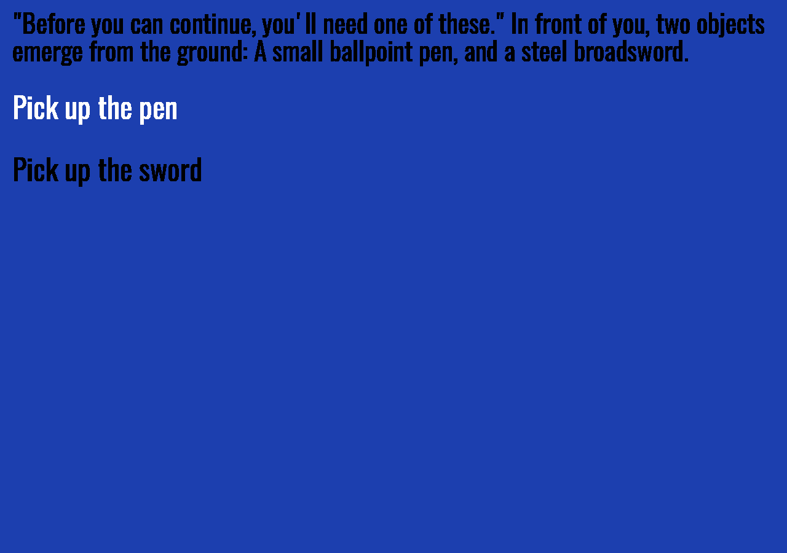

# Primordials

Author: Dominic Calkosz

Design: This game presents a brief interactive narrative, in which the coherence is tied to your pace.

Text Drawing: A font is loaded from file initially but then rendered each frame during runtime so that font size may vary freely.
Text is stored as strings in a graph of Item vectors (hard-coded in story_menu.cpp), but is edited during runtime.
Text is shaped with HarfBuzz and rendered with FreeType. The only font file used is Oswald-Regular.ttf.

Screen Shot:

How To Play:

* W/S or Up/Down - Navigate options
* E or Space - Select option
* Q - Quit

Sources: All content haphazardly written by me.

This game was built with [NEST](NEST.md).

